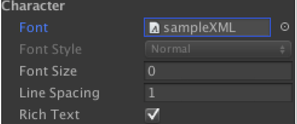
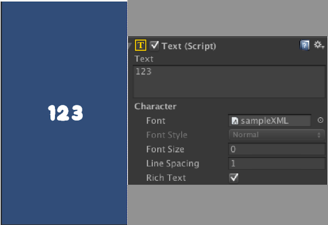
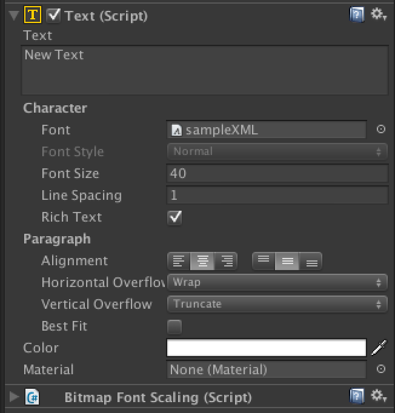
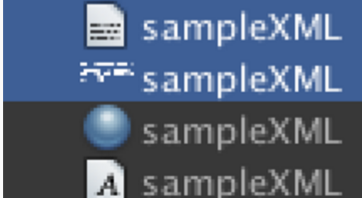

# bitmapfont-for-ugui ver 1.1

- BitmapFontをuGUIで使うためのスクリプト
- 対応バージョン Unity 5.5.3

### 更新履歴
- 2017/4/23 
  - Unity5.5.3 動作確認
- 2016/2/4 v1.1 
  - Unity5.3.1 対応
- 2015/12/6 v1.0

### BitmapFontGeneratorの使い方
1. BMFontなどでアトラスファイルとfntファイルを出力する。
  - BMFontを使う場合、fntファイルの形式は<b>「XML」形式</b>を選択する。

1. BitmapFontGenerator.csをEditorフォルダへ追加。

1. フォントアトラスファイルとfntファイルを選択状態に。

1. 右クリック、Create→BitmapFontを選択。

1. 同一フォルダにFontSettingファイルとMaterialファイルが作成される。

### 出力したFontSettingファイルを使う
TextコンポーネントのFont欄に出力したFontファイルをリンクする。
Text欄に文字を打ち込むとビットマップフォントが画面に表示される。

(4)ビットマップフォントでもFontSizeで大きさを変更する
-----

Textコンポーネントがついたゲームオブジェクトにスクリプトをアタッチする。

Add Component -> Bitmap Font Scaling

図のようにTextと同じオブジェクトにくっつける。

 
下図の1行目のテキストはFontSize:40で
2行目のテキストはFontSize:25に設定している。
サイズの制御はTextのFontSizeを変更することで反映される。

- TrueTypeのフォントの場合、BMFontで出力する時にFont Settingsの【Render from TrueType outline】と【Match char height】にチェックを入れること。
